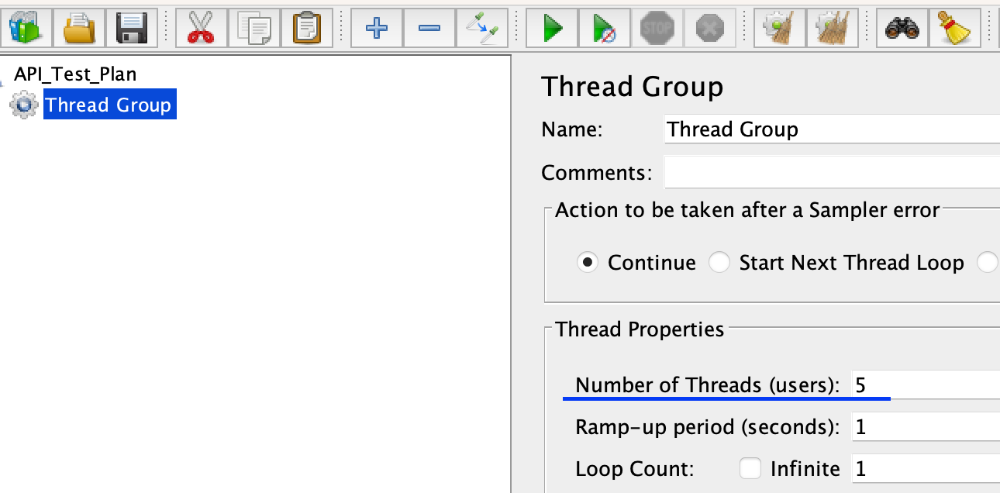
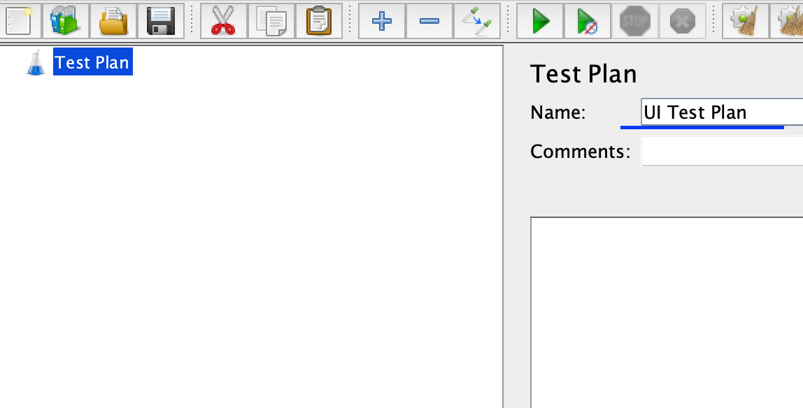
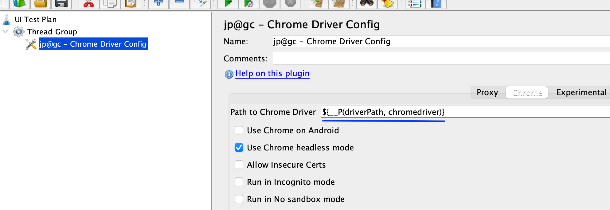

# JMeter

## Table of contents

1. [What is JMeter?](#what-is-jmeter)
2. [Configuring JMeter](#configuring-jmeter)
3. [JMeter Components](#jmeter-components)
4. [Quick Start Guide](#quick-start-guide)
5. [API Request and Response Overview](#api-request-response-overview)
6. [JMeter for API Testing](#jmeter-for-api-testing)
7. [JMeter for UI Testing](#jmeter-for-ui-testing)

## What is JMeter?

JMeter is an open-source performance testing tool that is widely used for testing the performance and load of web applications. It allows users to simulate various scenarios and measure the performance of the target application under different loads and conditions. It is a versatile and powerful tool that helps developers and testers ensure the reliability, scalability, and efficiency of their web applications.

## Configuring JMeter

1. Go to the official JMeter [website](https://jmeter.apache.org/download_jmeter.cgi) and choose the appropriate version of JMeter for your operating system (e.g., Windows, Linux, macOS) and click on the download link.
2. Once the download is complete, extract the downloaded file to a directory of your choice. This will create the JMeter installation directory.
3. Before running JMeter, make sure you have Java Development Kit (JDK) installed on your system. JMeter requires JDK to run.
4. Configure the environment variables for Java. This step may vary depending on your operating system. 
    >`For Windows`: Set JAVA_HOME environment variable to the directory where JDK is installed   
    (e.g., <b>C:\Program Files\Java\jdk1.x.x_xx</b>).  

    >`For Linux/macOS`: Set JAVA_HOME environment variable in your shell profile   
    (e.g., <b>~/.bash_profile</b>).
5. Open a command prompt or terminal and navigate to the JMeter bin directory.
6. Run the JMeter executable file:
    >`For Windows`: Run <b>jmeter.bat</b>  
    >`For Linux/macOS`: Run <b>./jmeter.sh</b>
7. JMeter will start, and you can begin using it to create and execute performance tests.
    ```
    Make sure to refer to the official JMeter documentation for detailed instructions.
    ```

## JMeter Components

JMeter has several components. Below is a explanation of each component:

1. <b>Thread Group:</b> Manages the runtime and number limitations of requests. It is essential for conducting performance tests.
2. <b>Sampler:</b> Generates requests for various protocols and is primarily used for editing user request data.
3. <b>Configuration Element:</b> Assists in simplifying the editing of request data by providing auxiliary functionalities.
4. <b>Pre-Processor:</b> Manages data before a request is sent.
5. <b>Post-Processor:</b> Manages data after a response is received.
6. <b>Timer:</b> Controls the runtime of requests.
7. <b>Assertion:</b> Performs expected result checks on response content.
8. <b>Logic Controller:</b> Controls the execution order and rules of various requests or elements.
9. <b>Listener:</b> Displays the final results, which can be presented in graphical or data format.

## Quick Start Guide

1. Clone the jmeter repository.
2. Open a shell window and navigate to the bin directory where jmeter is installed.
3. Type the command
    ```
    ./jmeter.sh
    ```
4. The Apache JMeter application will be launched.
5. Open the jmx file under the TestPlans folder - this folder contains two file `API_Test_Plan.jmx` and `UI_Test_Plan.jmx`.
6. With the jmx file opened, click on the green `Run` button to run the jmeter tests and view the results using a listener (e.g. Summary Report).

> IMPORTANT  
> This repository uses Chrome version 113.0.5672.63 for UI tests.

## API Request Response Overview

For the purpose of this test, we will use one of the NASA Api's.

### Request
  ```
  GET /insight_weather/
  ```

  ```http
  curl --request GET \
    --url 'https://api.nasa.gov/insight_weather/?api_key=IxpTyqs8LnclBrUq88cIdf99zftbzPgHYbmEzb1V&feedtype=json&ver=1.0' \
  ```
  | Parameter | In | Type | Required |
  | :--- | :--- | :--- |:--- |
  | `api_key` | `query` | `string`| `true` |
  | `feedtype` | `query` | `string`| `true` |
  | `ver` | `query` | `number`| `true` |

### Response

Response: 200 OK

## JMeter for API Testing

1. <b>Launch JMeter</b>

    Open a shell window, navigate to the bin directory where JMeter is installed and provide the JMeter executable file.
      
    ```
    bin % ./jmeter.sh
    ```

1. <b>Create an API Test Plan</b>

    In the JMeter interface, rename the default Test Plan to 'API Test Plan`.

    

1. <b>Add a Thread Group</b>

    Right-click on the `API Test Plan` and select "Add" -> "Threads (Users)" -> "Thread Group". This will create a Thread Group element, which represents a group of users.

    

1. <b>Configure the Thread Group</b>

    Set the desired number of threads (virtual users) and the ramp-up period (time to start all threads) in the Thread Group element. You can also specify the loop count and duration of the test.

    

1. <b>Add an HTTP Request Sampler</b>

    Right-click on the Thread Group, select "Add" -> "Sampler" -> "HTTP Request". This will add an HTTP Request Sampler to the Thread Group.

    

1. <b>Configure the HTTP Request Sampler</b>
    Provide the necessary details such as the server name or IP address, port, protocol, path, and method (GET, POST, etc.) in the HTTP Request Sampler. You can also add parameters, headers, and body data as required.

    

1. <b>Add Listeners</b>
    Listeners are used to view and analyze the test results. Right-click on the Thread Group, select "Add" -> "Listener" and choose the desired listener, such as "View Results Tree" or "Summary Report".

    

1. <b>Run the Test</b>
    Click on the "Play" button in the JMeter toolbar to start the test execution. JMeter will send requests to the specified API endpoints based on the configured settings.

    

1. <b>Analyze the Results</b>
    Once the test execution is complete, analyze the results using the chosen listeners. You can view response times, error rates, and other metrics to evaluate the performance and functionality of the API.

    

1. <b>Customize and Enhance the Test</b>
    JMeter provides various options to customize and enhance your API tests. You can add assertions to validate response data, use timers to introduce delays between requests, and incorporate logic controllers to create complex test scenarios.

## JMeter for UI Testing

1. <b>Create a UI Test Plan</b>

    In the JMeter interface, rename the default Test Plan to 'UI Test Plan`.

    

1. <b>Add and Configure a Thread Group</b>

    Right-click on the `UI Test Plan` and select "Add" -> "Threads (Users)" -> "Thread Group". This will create a Thread Group element, which represents a group of users. Set the desired number of threads (virtual users) and the ramp-up period (time to start all threads) in the Thread Group element. You can also specify the loop count and duration of the test.

    

1. <b>Download Chrome Driver</b>

    Download the chromedriver compatible with your chrome browser version from [here] (https://chromedriver.storage.googleapis.com/). Rename it to `chromedriver` and place it in your jmeter bin directory.

1. <b>Add ChromeDriver Config Element</b>

    Right-click on the `UI Test Plan` and select "Add" -> "Config Element" -> "Chrome Driver Config".

    

1. <b>Configure the Chrome Driver Config</b>

    Click on the `Chrome Driver Config`, click on the "Chrome" tab in the center. Add the path to your config
    ```
    ${__P(driverPath, chromedriver)}
    ```

    

1. <b>Configure the Web Driver Sampler</b>

    Right-click on the `UI Test Plan` and select "Add" -> "Sampler" -> "Web Driver Sampler".

    

1. <b>Configure the script for Web Driver Sampler</b>

    Click on the `Web Driver Sampler` and place the below script in the `script` section.

    ```
    WDS.sampleResult.sampleStart()
    WDS.browser.get('http://jmeter-plugins.org')
    WDS.sampleResult.sampleEnd()
    ```

    

1. <b>Add Listeners</b>

    Listeners are used to view and analyze the test results. Right-click on the Thread Group, select "Add" -> "Listener" -> "Summary Report".

    

1. <b>Run the Test</b>

    Click on the `Play` button in the JMeter toolbar to start the test execution. JMeter will open Chrome browser sessions based on your configured thread group settings.

1. <b>Analyze the Results</b>

    Once the test execution is complete, analyze the results using the chosen listeners. You can view response times, error rates, and other metrics to evaluate the performance and functionality of the UI in the Summary Report.

    
